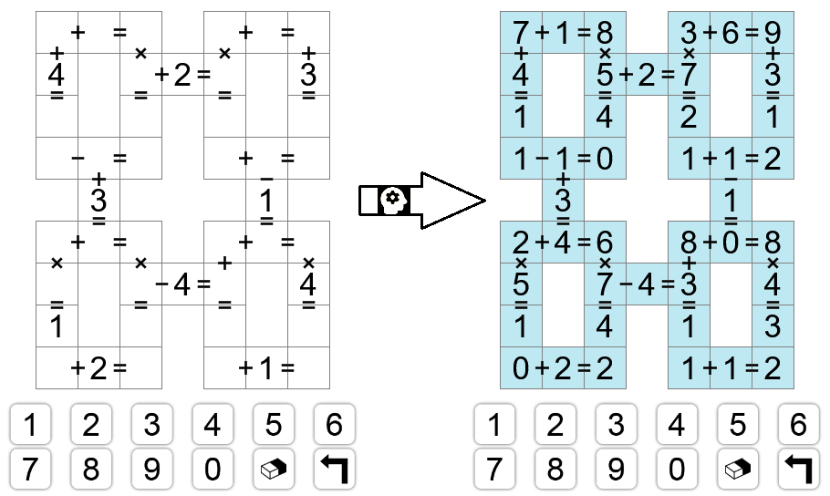

# Garam solver
🚧 Work in progress — not fully functional yet 🚧

This tool is designed to solve any <a href="https://www.garamgame.com/garam/garam_en_ligne/master/index.html">Garam grid ↗</a>.

Garam is a numerical crossword-style puzzle: fill in the 44 cells so that all 20 arithmetic expressions are simultaneously correct.

 <!-- nice x10 -->


# How to use the tool?
1. Go to the root directory
2. Run ```pip install -r requirements.txt``` to install the required package (only one)
3. Run ```python garam_solver.py``` to open an empty grid
2. Fill in the grid with the initial digits and operators
3. Click the ```Solve``` button (you probably guessed it)
4. The solution is displayed in plain text on the terminal
5. ???
6. Profit

Notes:
- Step 2 is tedious. In the future, a screenshot or a URL _may_ be used to auto-fill the grid instead of manually entering about 30 values.
- In step 3, you may instead enter ```python garam_solver.py --mini``` to play with a mini-Garam (20% of a full grid).

# OK, but what was the point of this?
Well, I could not find any solver for this (addictive) game, so I made this.

(You may this? No, _I_ made this 🙂.)
